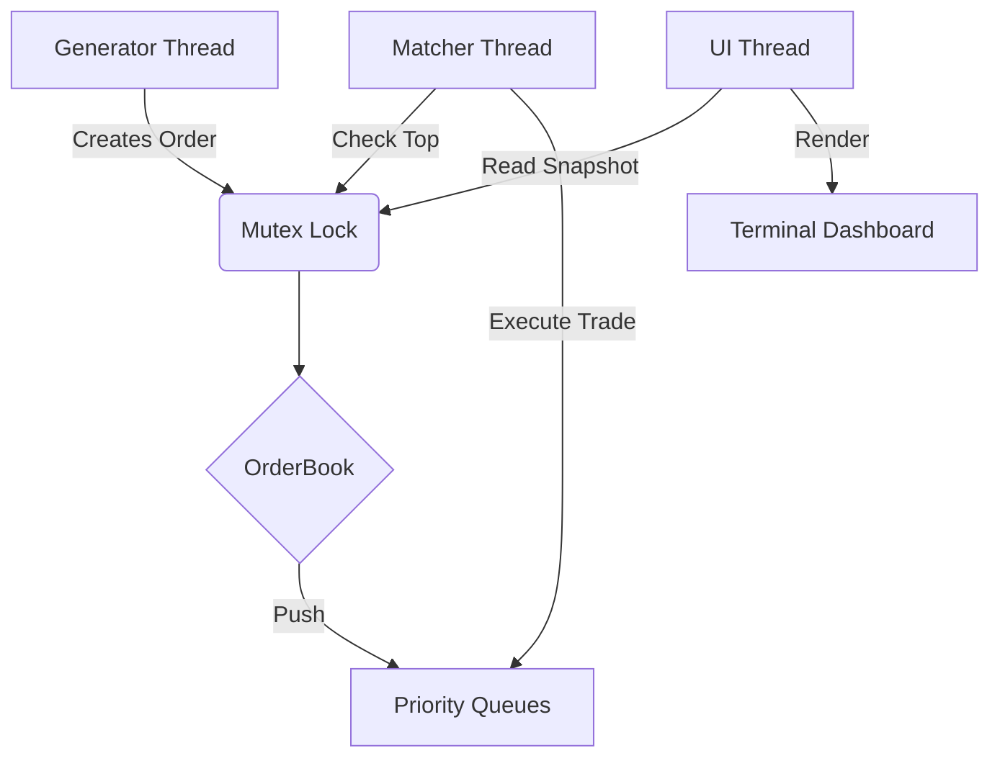

# Stock Exchange Matching Engine - Documentation

## 1. Introduction
This project implements a high-performance **Continuous Limit Order Book (CLOB)** simulator in C++. It simulates a real-time trading environment where buy and sell orders are matched based on price-time priority algorithms. 

The system features a concurrent architecture with three threads (Generator, Matcher, UI) and a terminal-based dashboard that visualizes market depth in real-time using ANSI colors.

## 2. Research on Stock Exchanges
A Continuous Limit Order Book is the standard matching algorithm for most global exchanges (e.g., NASDAQ, NYSE).

### Core Concepts
* **Limit Orders:** An order to buy or sell a specific amount of stock at a specific limit price or better.
* **Matching Engine:** The core logic that continuously checks for crossing orders (where `Bid Price >= Ask Price`).

### Priority Rules
To ensure fairness and transparency, the engine ranks orders using **Price-Time Priority**:
1.  **Price Priority:** * **Buyers (Bids):** Higher prices are better.
    * **Sellers (Asks):** Lower prices are better.
2.  **Time Priority (FIFO):** * If two orders have the exact same price, the one that arrived *earliest* (lowest ID/Timestamp) executes first.


## 3. Software Design and Implementation

### 3.1 System Architecture
The simulation runs on a multi-threaded architecture to decouple order generation from execution and visualization.

| Thread | Responsibility |
| :--- | :--- |
| **Generator** | Simulates market activity using a "Random Walk" algorithm to create realistic price movements and sends orders to the book. |
| **Matcher** | Continuously checks the top of the priority queues. If a match is found, it executes the trade and updates quantities. |
| **UI Thread** | Clears the screen and renders the top levels of the Order Book using a read-only snapshot. |

### 3.2 Data Structures
We used `std::priority_queue` to strictly enforce the sorting rules with $O(\log N)$ insertion time.

* **`buys_` Queue:** Max-Heap behavior (High Price > Old Time).
* **`sells_` Queue:** Min-Heap behavior (Low Price > Old Time).

### 3.3 Synchronization (Concurrency)
Since three threads access the `OrderBook` simultaneously, we used **`std::mutex`** and **`std::lock_guard`** in every method (`add_order`, `match`, `snapshot`) to prevent race conditions and ensure data integrity.

### 3.4 Class Diagram & Flow

## 4. Key Code Snippets

### Priority Comparators
This is the logic that enforces the Stock Exchange rules within the Priority Queues. Note how we handle the tie-breaking by ID (Time).

```cpp
// Defined inside OrderBook class
struct BuyCmp {
    bool operator()(const Order& a, const Order& b) const {
        if (a.price != b.price)
            return a.price < b.price; // Higher price = Higher priority
        return a.id > b.id;           // Lower ID (Older) = Higher priority
    }
};

struct SellCmp {
    bool operator()(const Order& a, const Order& b) const {
        if (a.price != b.price)
            return a.price > b.price; // Lower price = Higher priority
        return a.id > b.id;           // Lower ID (Older) = Higher priority
    }
};
```
### Matching Logic
The engine continues to execute trades as long as the best buyer is willing to pay at least what the best seller is asking.

```cpp
while (!buys_.empty() && !sells_.empty()) {
    Order buy = buys_.top();
    Order sell = sells_.top();

    if (buy.price >= sell.price) {
        // 1. Calculate execution quantity
        uint64_t trade_qty = std::min(buy.qty, sell.qty);
        
        // 2. Update Book State
        buys_.pop(); sells_.pop();
        
        // 3. Handle Partial Fills (Re-insertion)
        // The re-inserted order keeps its original ID/Timestamp
        if (buy.qty > trade_qty) { 
            buy.qty -= trade_qty; 
            buys_.push(buy); 
        }
        if (sell.qty > trade_qty) { 
            sell.qty -= trade_qty; 
            sells_.push(sell); 
        }
    } else {
        break; // No more matches possible
    }
}
```
## 5. How to Build and Run

### Requirements
* A C++ Compiler (GCC/Clang/MSVC) supporting C++11 or higher.
* Standard libraries (`<thread>`, `<mutex>`, `<queue>`).

### Build Commands
Open your terminal in the project folder and run:

**Linux / macOS / WSL:**
```bash
g++ main.cpp orderbook.cpp -o exchange -pthread
```
**Windows (MinGW/PowerShell):**
```bash
g++ main.cpp orderbook.cpp -o exchange
```
**Running**
```bash
./exchange
```
*Press **ENTER** to stop the simulation cleanly.*

## 6. Conclusions and Learnings

* **Efficiency of Priority Queues:** We learned that `std::priority_queue` is the ideal structure for an order book because it provides instant access to the "Best Bid" and "Best Ask", which is critical for the matching engine loop.
* **Concurrency Challenges:** Implementing the dashboard revealed the complexity of shared memory. Without the `mutex`, the UI thread would try to read the queues while the Matcher thread was modifying them, causing segmentation faults.
* **Market Mechanics:** This project helped visualize how liquidity works. We saw how "spreads" (the gap between buy and sell prices) naturally form and close as trades happen.

## 7. Future Improvements
1.  **Order Types:** Add Market Orders (execute immediately at any price) and IOC (Immediate or Cancel).
2.  **Persistence:** Log all executed trades to a CSV file for audit trails.
3.  **Cancellations:** Use a Hash Map (`std::unordered_map`) to map OrderIDs to their position in the queue to allow cancellation in constant time $O(1)$.
